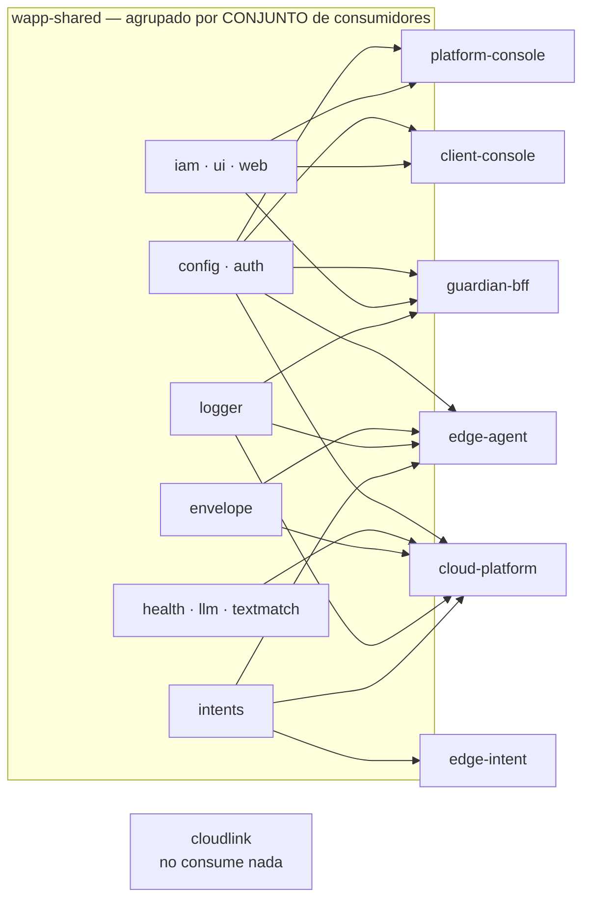
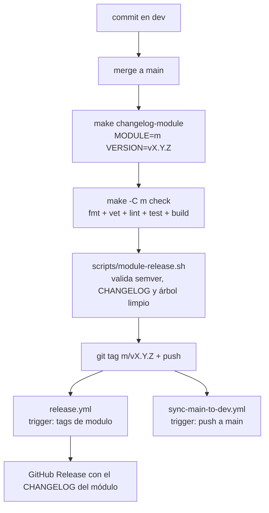

# Arquitectura de `wapp-shared`

> Cómo está hecha por dentro. Verificado contra `main` a **2026-08-30** (HEAD `ff741c0`).
> Las versiones publicadas son el tag más alto de cada módulo a esa fecha.

---

## 1. La forma: no hay capas, hay ONCE módulos hermanos

`wapp-shared` **no tiene arquitectura en capas porque no tiene una aplicación**. Es un monorepo de
librerías: once módulos Go independientes, **todos de nivel 0**, que no se importan entre sí. La
única jerarquía real es *fuera*: los seis repos que los consumen.

- **Punto de entrada: ninguno.** `find . -name 'main.go' -o -type d -name cmd` → vacío.
- **Binarios que produce: ninguno.** El único `package main` del repo es `.eval-t183/gen.go`, que
  lleva `//go:build ignore` en su primera línea y vive en un directorio oculto **sin `go.mod`**:
  ningún `go build ./...` lo compila jamás.
- **Dos centros de gravedad**, medidos por tamaño y por consumo: `llm` (2.119 líneas de producción,
  la mayor) y `web` (1.626 + `web/gin`), que sostiene las tres consolas SSR. Detrás,
  `textmatch` (765) y `auth` (605).

```
wapp-shared/
├── .github/workflows/   ci.yml (manual) · release.yml (por tag) · sync-main-to-dev.yml
├── scripts/             ingeniería de releases: manifest + 8 scripts bash + module-common.mk
├── .eval-t183/          herramienta muerta de un experimento (ver deuda.md)
│
├── auth/jwt/            JWT del plano de contexto + service token M2M
├── config/              loader YAML + overlay de entorno
├── envelope/            AES-256-GCM (DEK) + sellado anónimo X25519
├── health/              contrato Checker/HealthCheck
├── iam/                 cliente del plano de identidad (login/refresh/logout + canje)
├── intents/             contrato canónico de configuración de intenciones
├── llm/                 puerto LLMProvider + prompts + parsers
│   ├── api/             implementación contra API externa
│   └── testdata/
├── logger/              logging estructurado sobre log/slog
├── textmatch/           motor determinista de comparación de textos (2 niveles)
├── ui/css/              5 hojas CSS embebidas
└── web/                 middleware endurecido (solo decisiones)
    └── gin/             paquete `webgin`: adaptador delgado a Gin
```

---

## 2. Mapa módulo → consumidores



Los módulos están agrupados por **conjunto de consumidores idéntico**, no por tema: los seis nodos
de la izquierda son los seis conjuntos distintos que existen hoy. La tabla exacta módulo a módulo,
con versiones pineadas y número de ficheros que importan cada uno, está en
`documentations/contratos.md` §1.

**Lo que hay que leer del dibujo:** `cloudlink` **no consume nada** de `wapp-shared` (su `go.mod`
solo pide gRPC y protobuf) — es la excepción a la frase «lo consumen los repos Go de wApp», que
circula sin matiz por la documentación del ecosistema. Y `guardian-app` es KMP: no tiene `go.mod`.

---

## 3. Un módulo por sección

Formato de cada ficha: **qué hace · versión publicada más alta · quién lo consume**.
Las versiones de consumo salen de los `go.mod` de los repos hermanos; los conteos de imports, de
un `grep` de imports reales sobre sus `*.go`.

### 3.1 `logger` — logging estructurado

Interfaz `Logger` mínima con métodos por nivel (`Debug`/`Info`/`Warn`/`Error`) y `With` para
derivar loggers hijos que arrastran campos clave/valor. La implementación por defecto se apoya
**exclusivamente en `log/slog`**. Trae además un logger en `context.Context` (`logger/context.go`).
Semántica variádica de slog: pares clave/valor.

- **Publicado: `logger/v0.2.0`** (`a7ed61b`, 2026-08-01). **Cero dependencias**, ni de test.
- **Consumen:** `cloud-platform` (115 ficheros), `edge-agent` (73), `guardian-bff` (1).
  Es el módulo más importado del ecosistema.

### 3.2 `config` — carga de configuración

`Loader` construido con `New` y opciones funcionales: `WithFile(...)` (YAML) + `WithEnvPrefix(...)`
(overlay de entorno) + getters tipados con default. `Unmarshal` **no falla si el fichero no
existe**: simplemente no aplica overlay de fichero.

🔴 **El prefijo lo compone el módulo.** Con `config.WithEnvPrefix("WAPP_")`, el literal
`LOG_LEVEL` del código del consumidor es la variable **`WAPP_LOG_LEVEL`**. Los tres consumidores de
consola usan ese prefijo exacto.

- **Publicado: `config/v0.3.0`** (`a7ed61b`, 2026-08-01). Dependencia: `gopkg.in/yaml.v3`.
- **Consumen:** los cinco repos Go de aplicación con consola o núcleo (`cloud-platform`,
  `edge-agent`, `guardian-bff`, `client-console`, `platform-console`), un fichero cada uno.

### 3.3 `envelope` — las dos primitivas del modelo de doble llave

Dos capas:

- **Simétrica:** AES-256-GCM, nonce aleatorio de 12 B por valor prefijado al ciphertext. Formato en
  disco `nonce(12B) || ciphertext || tag(16B)`, `Overhead = 28`, `DEKSize = 32`
  (`envelope/envelope.go:13-26`). Es lo que cifra el store de `whatsmeow` con una clave que el
  servidor no conoce en claro.
- **Asimétrica:** sellado anónimo X25519 vía NaCl box (`GenerateKeyPair`, `SealFor`, `OpenWith`,
  `envelope/sealing.go`). Es la pieza que **mueve una DEK entre dispositivo y servidor sin que el
  transporte la exponga**: el dispositivo sella con la pública del servidor y el servidor abre con
  su privada; en el emparejamiento, al revés.

Solo criptografía de stdlib y `golang.org/x/crypto`. **Cero construcciones caseras.**

- **Publicado: `envelope/v0.2.1`** (`0967683`, 2026-08-02).
- **Consumen:** `cloud-platform` (9 ficheros), `edge-agent` (23).

### 3.4 `health` — el contrato de los health checks

Patrón `Checker` + `HealthCheck`: cada componente implementa `Name`+`Check`, se registra con
`Register`, y `CheckAll` los ejecuta y agrega los resultados **indexados por nombre**. Un estado
`degraded` **no** marca al conjunto como unhealthy; solo `unhealthy` lo hace.

Deliberadamente **no implementa ningún check contra un driver concreto**: define únicamente el
contrato.

- **Publicado: `health/v0.1.1`** (`9190f01`, 2026-07-10). Solo `testify` de test.
- **Consumen:** `cloud-platform` (5 ficheros). Es el único.

### 3.5 `auth` (paquete `auth/jwt`) — el plano de contexto

Emite y valida los JWT de usuario del ecosistema. Claims simplificados a
`{tenant_id, user_id, roles, grants}` (`auth/jwt/jwt_claims.go:31`), `TokenUseAccess = "access"`.
Dos algoritmos: **ES256 asimétrico** (el que se usa) y HS256 simétrico. La firma ES256 estampa un
`kid` en la cabecera (`JWTManager.WithKid`) y **`MultiVerifier` selecciona la llave por ese `kid`**,
lo que permite rotar llaves y algoritmos sin invalidar los tokens en vuelo. Tolerancia de reloj
fija: `clockLeeway = 30 * time.Second` (`auth/jwt/jwt_manager.go:15`).

Trae además un **service token M2M** por scopes (`auth/jwt/service_claims.go`,
`TokenUseService = "service"`) que hoy **no construye nadie** (ver `documentations/deuda.md`).

El refresh opaco **no** está aquí: lo emite identity. `Grants` es un **alias** de
`identity-shared/auth/rbac.Grants`: este paquete los transporta, `rbac` los evalúa.

- **Publicado: `auth/v0.5.0`** (`36a4afd`, 2026-08-14). Es el único módulo con dependencia a un
  repo externo del grupo (`identity-shared`).
- **Consumen:** `cloud-platform` (21), `guardian-bff` (3), `client-console` (4),
  `platform-console` (2) — todos en `v0.5.0` — y ⚠️ **`edge-agent` pineado en `auth v0.4.1`**
  (`edge/wapp-edge-agent/go.mod:9`), el único consumidor desalineado del ecosistema. Confirmado en
  la máquina de UAT: el binario del Edge lleva `auth v0.4.1` dentro.

### 3.6 `intents` — el contrato de configuración de intenciones por tenant

Define y **valida** el contrato que produce el operador (por el API de cloud-platform) y consumen
dos lados: cloud-platform al recibir el PUT, y `wapp-edge-intent` para alimentar al clasificador.
**Este módulo no clasifica.**

Reglas duras de `ParseAndValidate` (`intents/intents.go:62-120`): tope `MaxConfigBytes = 256 KiB`;
`version` no vacía; al menos un intent; `name` contra `^[a-z][a-z0-9_]{1,63}$`; el nombre
`"desconocido"` está **reservado**; nombres únicos; `umbral_confianza` en (0,1] o
`DefaultThreshold = 0.6`. **Tolera campos desconocidos a propósito** (no usa
`DisallowUnknownFields`).

- **Publicado: `intents/v0.1.0`** (`8bee388`, 2026-07-11).
- **Consumen:** `cloud-platform` (3), `edge-agent` (3), y **`edge-intent`, para el que es su única
  dependencia** (4 ficheros).

### 3.7 `llm` — el puerto único al modelo de lenguaje

El módulo mayor. Contiene **el puerto, los prompts, los parsers y el centinela**, y ninguna
decisión de enrutado.

`LLMProvider` (`llm/provider.go:162`) tiene **exactamente cinco métodos, uno por etapa del
pipeline de cotización**: `ClassifyRequest` (P1), `ExtractMainIdeas` (P2), `ExtractItemSpecs` (P3,
**una llamada por ítem**), `NormalizeQuantities` (P4), `GenerateQuoteText` (P5). Todos devuelven
`json.RawMessage` que valida el llamante: un modelo que alucine el formato se rechaza igual que un
JSON malo de cualquier otra fuente.

Piezas:

- `llm/prompt.go` (401 líneas) — **el texto compilado** de los prompts, y los constructores
  `Build*Prompt`. Los prompts viven aquí, fuera de las implementaciones, para que entre vías cambie
  el transporte y **nunca el prompt**.
- `llm/parse.go` (632 líneas) — los `Parse*` y los artefactos versionados
  (`ArtifactVersion = 1`): `Classification`, `MainIdeas`, `ItemSpecs`, `Quantities`, `QuoteText`,
  `NormalizedItem`, `Range`.
- `llm/plantilla.go` — el contrato de los **ficheros de prompt ajustables sin release**. `Etapa` es
  `"p2"`, `"p3"`, `"p4"`, `"p5"`, y **ese literal, el prefijo `pN-`, es lo que empareja fichero con
  etapa**. `ValidarPlantilla` (`llm/plantilla.go:142`) es lo que hace que una plantilla inválida
  aborte el arranque en vez de servirse.
- `llm/errors.go` — `ErrLLMQuality`.
- `llm/api/` — la implementación contra API externa: **anthropic real, gemini stub que falla
  siempre**.

**Sin registro de proveedores, sin factory tarea→proveedor, sin tabla de rutas** (D-044.21): quien
arranca el proceso elige UNA implementación. La vía local existe pero su adaptador vive en
`cloud-platform`, hablando el frame de inferencia de CloudLink contra el Ollama del Edge — **no
aquí**.

- **Publicado: `llm/v0.4.5`** (`40a424e`, 2026-08-26). Sin dependencias de producción.
- **Consumen:** `cloud-platform` y solo él (51 ficheros importan `llm`, 3 importan `llm/api`).

### 3.8 `textmatch` — comparación determinista de textos

Decide si un texto del cliente corresponde a un ítem conocido (un producto, una variante, un tag)
**sin inventar nada y sin depender de un LLM**. Copia-adaptación renombrada al namespace wApp; la
adaptación eliminó su única dependencia externa (el plegado de diacríticos es propio y de stdlib,
`textmatch/normalize.go`, y **preserva la ñ**).

Dos niveles ortogonales:

- **Nivel 1 (`Comparator`/`Cascade`):** ¿este esperado ≈ este candidato? Cascada barata→cara
  Exact → Fuzzy → zona gris. Positivo corta; incierto escala; un error se propaga.
- **Nivel 2 (`SetMatcher`):** conjunto contra conjunto, con política de completitud
  (`Strict`/`Lenient`) que es decisión de negocio.

El escalón caro se define como la interfaz `GrayZone` y **se inyecta**: el módulo **no importa
`llm`**.

- **Publicado: `textmatch/v0.1.0`** (`c3e2dc2`, 2026-08-26).
- **Consumen:** `cloud-platform` (13 ficheros) — y **solo el Nivel 1**: los símbolos que aparecen
  son `Normalize` (22 usos), `SplitTokens` (9), `Result` (6), `OutcomeMatch` (6), `NewFuzzy` (3),
  `Cascade`, `Exact`, `EditDistance`. **Cero usos de `SetMatcher`.**

### 3.9 `web` — el middleware endurecido, partido en dos paquetes

La capa transversal de toda consola SSR: nonce y CSP, CSRF double-submit, rate-limit por clave,
allowlist CORS, política de cookies, deadline por petición, single-flight de refresh, tope de
cuerpo y traducción de flashes.

**La partición en dos paquetes es deliberada:**

- **`web`** es **solo stdlib (+ `golang.org/x/time/rate`)**: **decide, no sirve**. Trabaja sobre
  `http.Header`, cadenas y relojes, y **no conoce ningún framework**.
- **`web/gin`** (nombre de paquete **`webgin`**) es el adaptador delgado a Gin, aparte porque es el
  primer sitio del monorepo que trae Gin y quien solo quiere el algoritmo no tiene por qué
  arrastrar los handlers.

Nació **reconciliando dos copias divergidas** (la del BFF del cliente y la de la consola de
operadores) y **ninguna ganó entera**: la CSP que se sirve es la **unión** de las dos.

- **Publicado: `web/v0.2.0`** (`cb066f4`, 2026-08-28). Deps: `gin-gonic/gin v1.10.0`,
  `golang.org/x/time v0.6.0`.
- **Consumen:** las **tres** consolas: `guardian-bff` (12 ficheros `web` + 7 `web/gin`),
  `client-console` (13 + 9), `platform-console` (10 + 6).

### 3.10 `iam` — el cliente del plano de identidad

Login, refresh y logout contra **identity-api** (el SSO del grupo) y **canje** del Identity Token
por el Context Token que emite la plataforma de wApp. Reconcilia otras dos implementaciones
copiadas que habían divergido en cosas que importan (el 403 del System Gate frente al 401 de
credenciales, la exigencia del par de tokens completo, el timeout configurable o clavado).

**Las dos credenciales, y por qué son dos:** el **Identity Token** dice *quién eres* y no puede
llevar claims de negocio (el tenant no está ahí); el **Context Token** dice *qué puedes hacer en
wApp*. `Login`/`Refresh` hacen los dos saltos server-to-server y devuelven **siempre** el Context
Token — el Identity Token muere dentro.

**Nivel 0 estricto:** no importa ningún otro módulo de `wapp-shared` (**tampoco `auth`**) ni
ninguna dependencia externa. Los claims del Context Token se leen decodificando el payload del JWT
con la stdlib **sin verificar la firma**, y solo para alimentar la traza: quien valida de verdad es
la plataforma en cada llamada.

- **Publicado: `iam/v0.1.0`** (`c872bbd`, 2026-08-28). **Cero dependencias.**
- **Consumen:** `guardian-bff` (3), `client-console` (2), `platform-console` (2).

### 3.11 `ui` — los assets del sistema de diseño

25 líneas de Go (`ui/ui.go`) y **452 de CSS**. `ui.Assets` es un `embed.FS` sobre `css/*.css`;
la API es `ui.FS()` (sub-enrutado en `css`) y `ui.GetCSS(name)`.

Cinco hojas: `wapp-tokens.css`, `wapp-components.css`, `theme-bff.css`, `theme-edge.css`,
`theme-platform.css`. **Orden de carga obligatorio: tokens → componentes → tema.**

Sus **384 líneas de test no prueban Go: prueban el CSS** — pares de color por componente, tokens de
texto definidos en los dos temas, legibilidad del snackbar, herencia del encabezado. Es un candado
estructural sobre las hojas.

- **Publicado: `ui/v0.4.1`** (`ff741c0` = **HEAD**, 2026-08-28).
- **Consumen:** las tres consolas (`guardian-bff` 1 fichero, `client-console` 2,
  `platform-console` 2). ⚠️ **El Edge Agent NO consume `ui`** — no lo declara en su `go.mod` — y
  por eso `theme-edge.css` no lo sirve nadie.

---

## 4. La maquinaria de releases



Piezas del andamiaje, todas en `scripts/`:

| Fichero | Qué es |
|---|---|
| `module-manifest.tsv` | **el inventario único**: los once módulos con `level`, `integration`, `coverage_validation`. Alimenta el `Makefile` raíz y los workflows. 🔴 Su separador es `\|`, no un tabulador |
| `module-common.mk` | el `Makefile` de cada módulo: 14 líneas de `include` le dan `build`, `test`, `lint`, `check`, `changelog`, `release` y los dos `*-dry-run` |
| `list-modules.sh` | resuelve `--set all\|level-N\|integration` desde el manifest |
| `module-release.sh` | valida y publica el tag |
| `update-module-changelog.sh` | promueve `## [Unreleased]` a `## [X.Y.Z]` |
| `auto-release.sh` | release automático a partir de los CHANGELOG modificados |
| `validate-coverage.sh` · `analyze-coverage.sh` | cobertura (no medida en este levantamiento) |
| `extract-changelog-section.sh` · `setup-hooks.sh` | auxiliares |

**Los tres workflows** (`.github/workflows/`):

- `ci.yml` — **`on: workflow_dispatch` y nada más.** El propio fichero lo explica: la validación
  continua es **local**. La lógica de scope por PR que describe en su cuerpo es **letra muerta**.
- `release.yml` — `on: push: tags: ['*/v*', '*/*/v*']`. No se dispara con tags `v*` sueltos, porque
  no hay módulo raíz.
- `sync-main-to-dev.yml` — `on: push: branches: [main]`. **El único que corre solo.** Deja `dev`
  alineada tras cada publicación; usa el `GITHUB_TOKEN` nativo, cuyo push no encadena workflows,
  así que no puede entrar en bucle.
